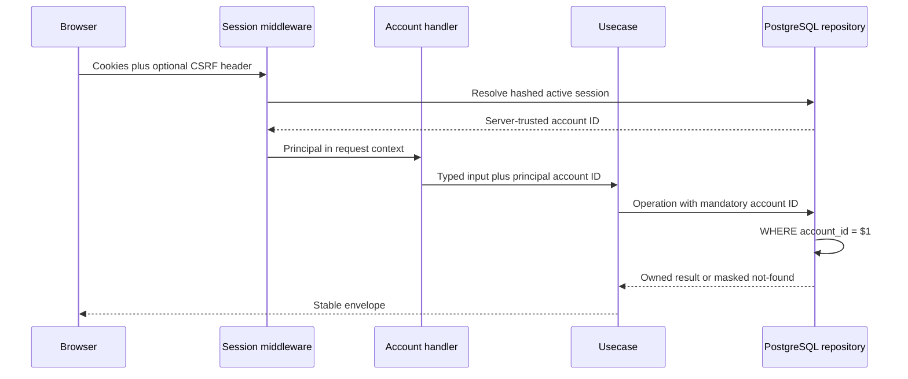

# Authenticated account workspace

IssueScout keeps its public discovery product anonymous and stateless.
GitHub sign-in unlocks only optional, account-owned bookmarks, named saved
searches, display preferences, export, and deletion. Nothing in this feature
changes the anonymous profile, repository, issue-search, or issue-detail
journeys.

## Ownership and request boundary

The API never accepts an account ID in a path, query, or body. Every repository
method requires the authenticated `account.ID` and includes it in every read,
update, and delete predicate. A resource owned by another account returns the
same `NOT_FOUND` response as a missing resource. Tests cover these predicates
so an opaque resource UUID cannot become an insecure direct object reference.

Account GET routes require both valid HttpOnly session and CSRF cookies. A
mutation additionally requires the current `X-CSRF-Token` returned by
`GET /api/auth/session`. If authentication is disabled, only account routes
return `AUTH_UNAVAILABLE`; public routes stay usable and database-free.

## Stored data

Bookmarks store only:

- target type (`issue` or `repository`);
- lower-case GitHub repository owner and name;
- a positive issue number when the target is an issue;
- opaque UUID, ownership, timestamps, and optimistic version.

The API returns `upstreamState: unverified`. GitHub objects can be renamed,
deleted, made private, or made inaccessible after they are bookmarked.
IssueScout does not run a background copy or persist a GitHub payload. The
frontend can use the anonymous repository or issue endpoint to revalidate a
reference when displaying it, and should offer deletion if it is stale.

Saved searches store a user-visible name, search type, and normalized JSON
filters. Issue filters pass through the same `issue.NewSearchCriteria`
constructor as anonymous issue discovery. Repository filters pass through the
same `repository.NewDiscoveryCriteria` constructor as anonymous repository
discovery. Defaults, trimmed values, supported SPDX identifiers, and bounds
are therefore canonical before storage.

Preferences store only:

- theme: `light`, `dark`, or `system`;
- reduced motion: `reduce`, `no-preference`, or `system`;
- result page size: `10`, `20`, or `50`.

Before the first preference write, the GET route returns
`system`/`system`/`20` with version zero without inserting a row.

## Bounds and concurrency

| Resource       | Per-account quota | Payload/name bound           | Stable order                          |
| -------------- | ----------------: | ---------------------------- | ------------------------------------- |
| Bookmark       |               200 | Normalized GitHub reference  | `created_at DESC, id DESC`            |
| Saved search   |                50 | 80-rune name, 8192-byte JSON | `updated_at DESC, id DESC`            |
| Preferences    |                 1 | Fixed enums and page sizes   | One row per account                   |
| List page size |                50 | Page 1–100                   | UUID is the deterministic tie-breaker |

Bookmark and saved-search quota checks take a transaction-scoped PostgreSQL
advisory lock keyed by account ID in the same statement as the insert. A
duplicate bookmark write is idempotent and returns the existing row without
incrementing its version. Saved-search names are unique case-insensitively per
account.

Saved-search updates, preference writes, and bookmark/saved-search deletes use
optimistic concurrency. Send the current `version`; a successful update
increments it. `VERSION_CONFLICT` means another request won and the client
must reload before retrying. `ACCOUNT_QUOTA_EXCEEDED` and
`DUPLICATE_SAVED_SEARCH` are separate conflict codes.

## Privacy export and deletion

`GET /api/account/export` returns a schema-versioned bounded document with all
bookmarks, saved filter definitions, and persisted preferences. It excludes:

- GitHub access tokens and GitHub response bodies;
- session, CSRF, and OAuth state hashes;
- privacy-audit identifiers;
- anonymous usernames, searches, analyses, clicks, and history.

`DELETE /api/account` requires CSRF plus the exact JSON confirmation
`{"confirmation":"DELETE"}`. The database deletes the account and cascades to
identities, sessions, bookmarks, saved searches, and preferences. The response
contains only removed row counts. A content-free `account_deleted` audit event
with a null account reference and timestamp remains for privacy-safe
operational evidence. Browser session cookies are expired after deletion.

Export is not a database backup or legal compliance guarantee. Deployment
owners remain responsible for backup retention, data-subject procedures,
audit retention, and jurisdiction-specific policy.

## API inventory

| Method | Path                                          | CSRF | Purpose                      |
| ------ | --------------------------------------------- | ---- | ---------------------------- |
| GET    | `/api/account/bookmarks`                      | No   | List owned bookmarks         |
| PUT    | `/api/account/bookmarks`                      | Yes  | Idempotent bookmark upsert   |
| DELETE | `/api/account/bookmarks/{bookmarkID}`         | Yes  | Versioned bookmark deletion  |
| GET    | `/api/account/saved-searches`                 | No   | List named filters           |
| POST   | `/api/account/saved-searches`                 | Yes  | Create a named filter        |
| PUT    | `/api/account/saved-searches/{savedSearchID}` | Yes  | Versioned filter replacement |
| DELETE | `/api/account/saved-searches/{savedSearchID}` | Yes  | Versioned filter deletion    |
| GET    | `/api/account/preferences`                    | No   | Read stored/default settings |
| PUT    | `/api/account/preferences`                    | Yes  | Versioned preference upsert  |
| GET    | `/api/account/export`                         | No   | Export bounded feature data  |
| DELETE | `/api/account`                                | Yes  | Permanently delete account   |

Use [`http/account-workspace.http`](../http/account-workspace.http) for every
success and rejection capability. Keep actual cookies and CSRF values in a
private HTTPYAC environment, never in the tracked file.
