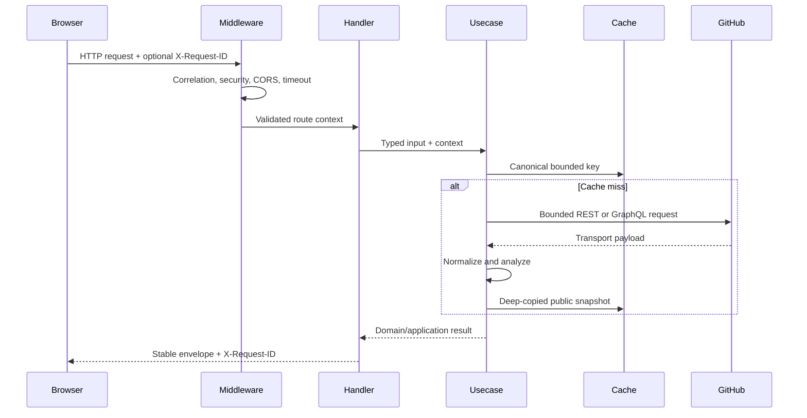

# HTTP API guide

The versioned [OpenAPI 3.1 contract](../packages/contracts/openapi.yaml) is the
source of truth. This guide explains the operational behavior; generated
frontend types must come from the contract.

## Request flow and trust boundary



## Envelope and headers

Successful responses use:

```json
{
  "data": {},
  "meta": {
    "requestId": "req_example",
    "timestamp": "2026-07-30T00:00:00Z"
  }
}
```

Errors use `error.code`, a safe fixed `error.message`, and the same `meta`.
Every documented response includes `X-Request-ID`; it matches
`meta.requestId`. A valid inbound value of 1–64 ASCII letters, numbers, `_`,
`-`, or `.` is echoed. Invalid or absent values are replaced.

Search and detail success responses also expose `X-IssueScout-Cache` as `HIT`
or `MISS`.

## Endpoints

| Method and path                                      | Purpose                                                       | Bounds                                                      |
| ---------------------------------------------------- | ------------------------------------------------------------- | ----------------------------------------------------------- |
| GET `/api/health`                                    | Liveness/readiness and request-correlation check              | No upstream or database access                              |
| GET `/api/github/users/{username}`                   | Normalized public user and repository summaries               | At most 20 repositories                                     |
| GET `/api/github/users/{username}/profile-analysis`  | Languages, frameworks, analyzed count, warnings               | 20 repositories, 3 manifests each, concurrency 5 by default |
| POST `/api/issues/search`                            | Eligible, ranked, paginated public issues                     | 50 candidates, 20 detail enrichments, page size at most 50  |
| GET `/api/issues/{owner}/{repository}/{issueNumber}` | Complete issue recommendation and bounded repository evidence | One canonical issue; every activity collection is bounded   |

Unknown JSON fields, malformed path values, unsupported query keys, control
characters, excessive collection sizes, and out-of-range pagination are
rejected before upstream I/O.

## Statuses

Every operation explicitly documents `403`, `500`, and `504` because CORS,
panic recovery, and request deadlines apply at the middleware boundary.
Feature routes additionally declare their possible `400`, `404`, `429`, and
`502` outcomes. The contract forbids a catch-all default response.

| Error code                   | Typical HTTP status | Meaning and caller action                                     |
| ---------------------------- | ------------------: | ------------------------------------------------------------- |
| `INVALID_REQUEST`            |                 400 | Fix request syntax, validation, or bounds                     |
| `GITHUB_USER_NOT_FOUND`      |                 404 | Check the public username                                     |
| `NOT_FOUND`                  |                 404 | Check the route, repository, or issue reference               |
| `GITHUB_RATE_LIMIT_EXCEEDED` |                 429 | Wait for normalized rate-limit recovery                       |
| `GITHUB_API_ERROR`           |                 502 | GitHub failed or returned unusable required data; retry later |
| `INTERNAL_SERVER_ERROR`      |                 500 | Unexpected failure was safely recovered; report request ID    |
| `REQUEST_TIMEOUT`            |                 504 | Caller cancelled or the bounded request deadline elapsed      |

Forbidden-origin responses use an error envelope without exposing allowlist
details. Error messages never include tokens, raw upstream bodies, issue
content, or internal stack traces.

## Search contract

`POST /api/issues/search?page=1&perPage=20` accepts:

- a required validated `username`;
- deduplicated languages, frameworks, and labels;
- star, recency, difficulty, effort, documentation, English, and archived
  filters;
- only the fields defined in OpenAPI.

Discovery order is stable: build safe GitHub qualifiers, retrieve one bounded
candidate window, apply eligibility, enrich at most 20 candidates, analyze,
filter effort, rank, then paginate. Equivalent condition ordering shares a
five-minute cache. Page and effort do not change the upstream candidate key.

## Contract maintenance

1. Edit `packages/contracts/openapi.yaml`.
2. Run `pnpm run contracts:lint` and `pnpm run contracts:policy`.
3. Regenerate frontend types with the web package generator.
4. Add or update shared fixtures.
5. Run `pnpm run contracts:check`.

The fixture test validates correct documents and proves that undocumented
envelope/payload fields and missing metadata fail. The policy test rejects
undocumented operational statuses, non-envelope JSON, missing request IDs,
duplicate operation IDs, and default statuses. The route check compares Gin
registration to every OpenAPI operation.
