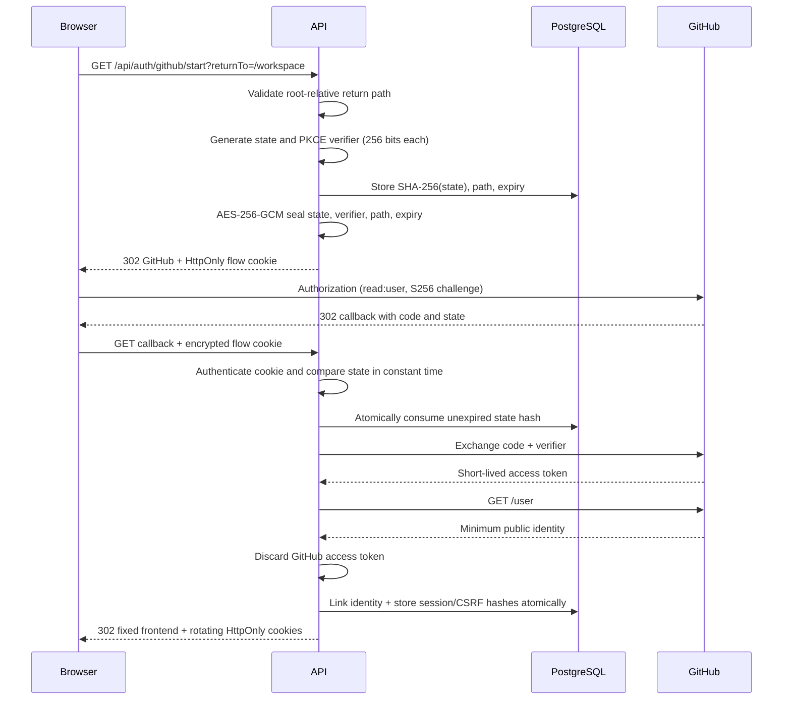
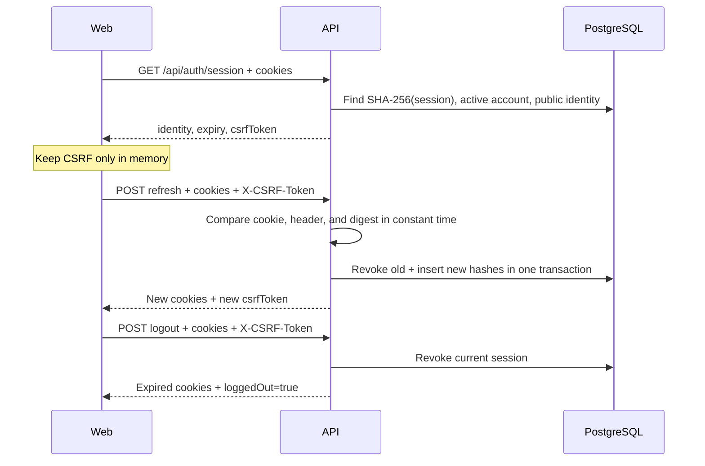

# Optional GitHub authentication

IssueScout authentication is an optional capability boundary, never an access
wall. Public profile analysis, repository discovery, issue discovery, issue
detail, process health, and the web shell work without OAuth, cookies, or
PostgreSQL. Authentication exists only for account-owned features.

## Runtime outcomes

`GET /api/auth/session` is the frontend bootstrap endpoint:

| Server and browser state                   | Result                                                      | Database call |
| ------------------------------------------ | ----------------------------------------------------------- | ------------: |
| OAuth group absent                         | `configured=false`, `authenticated=false`                   |          none |
| OAuth configured; cookies absent/malformed | `configured=true`, `authenticated=false`                    |          none |
| Cookies valid; active hashed session found | Public identity, expiry, and in-memory CSRF token           |           one |
| Cookies valid; session missing/expired     | Anonymous response and expired browser cookies              |           one |
| Cookies valid; PostgreSQL unavailable      | Safe `AUTH_UNAVAILABLE` response; public routes stay usable |       bounded |

The router does not register authentication middleware on anonymous routes.
Consequently, adding a browser cookie does not silently add a database lookup
to profile, repository, or issue requests.

## Enable locally

Create a GitHub OAuth App whose homepage is the local web origin and whose
authorization callback is exactly:

```text
http://127.0.0.1:8080/api/auth/github/callback
```

Copy `apps/api/.env.example` to the ignored `apps/api/.env`. Set a TLS
`DATABASE_URL` and these five values together:

```dotenv
GITHUB_OAUTH_CLIENT_ID=replace-with-client-id
GITHUB_OAUTH_CLIENT_SECRET=replace-with-client-secret
GITHUB_OAUTH_CALLBACK_URL=http://127.0.0.1:8080/api/auth/github/callback
AUTH_FRONTEND_URL=http://127.0.0.1:5173
AUTH_FLOW_ENCRYPTION_KEY=replace-with-64-lowercase-hex-characters
```

Generate a dedicated AES key:

```sh
openssl rand -hex 32
```

Keep `AUTH_COOKIE_SECURE=false` only for loopback development. Ensure
`AUTH_FRONTEND_URL` is also present in `ALLOWED_ORIGINS`, then migrate and
start:

```sh
pnpm run database:migrate
pnpm run database:verify
make dev
```

Open this entry point in the top-level browser:

```text
http://127.0.0.1:8080/api/auth/github/start?returnTo=/
```

All five values are an atomic configuration group. Supplying only some values,
enabling OAuth without `DATABASE_URL`, using a callback path other than
`/api/auth/github/callback`, or using insecure non-loopback URLs fails startup.
Leaving all five values empty explicitly disables authentication.

## Authorization sequence



GitHub authorization requests use the explicit minimum `read:user` scope,
the exact configured redirect URI, and PKCE `S256`. The API does not request
email, repository, organization, or offline-token scopes. It calls only the
authenticated public identity endpoint after exchange and never stores or
returns GitHub's access token.

Provider denial still requires the encrypted cookie and matching state, then
atomically consumes the database state. The browser returns to the fixed
frontend origin with `auth=denied`. Other provider errors use `auth=error`.
Provider descriptions are ignored rather than reflected.

## Return-path and redirect rules

`returnTo` is limited to 2,048 bytes and must be a root-relative path. The API
rejects absolute URLs, `//` scheme-relative paths, backslashes, and fragments.
It stores the validated path with the state hash and verifies the same value at
callback.

Final redirects are assembled from `AUTH_FRONTEND_URL`, never from a query
origin or provider value. Existing return-path query values are preserved and
one `auth=success`, `auth=denied`, or `auth=error` marker is added.

## Cookie policy

| Cookie role | HTTPS deployment name          | Content                    | Lifetime            |
| ----------- | ------------------------------ | -------------------------- | ------------------- |
| OAuth flow  | `__Host-issuescout_oauth_flow` | AES-GCM sealed flow values | Up to 15 minutes    |
| Session     | `__Host-issuescout_session`    | Random 256-bit token       | Up to seven days    |
| CSRF        | `__Host-issuescout_csrf`       | Random 256-bit token       | Matches the session |

Every cookie is `HttpOnly`, `Path=/`, and `SameSite=Lax`. HTTPS cookies are
also `Secure`, omit `Domain`, and use the `__Host-` prefix. Loopback
development omits only `Secure` and the prefix. `AUTH_COOKIE_SECURE=false` is
rejected in staging and production.

Both browser credentials are unpadded base64url values representing exactly
32 random bytes. PostgreSQL stores only SHA-256 digests. Missing, partial, or
malformed cookie pairs are classified as anonymous before a repository call.

The OAuth flow cookie is encrypted with AES-256-GCM and versioned authenticated
additional data. It is bounded to 4 KiB. Modification, unknown version,
malformed JSON, extra fields, invalid credentials, or expiry all produce the
same safe `INVALID_AUTH_STATE` outcome.

## Session and CSRF lifecycle



The CSRF cookie remains HttpOnly. The session endpoint returns its raw value
only after the cookie pair authenticates; the frontend keeps it in memory and
echoes it in `X-CSRF-Token`. Refresh and logout require:

1. a structurally valid session cookie;
2. a structurally valid CSRF cookie;
3. an active unexpired server-side session hash;
4. a CSRF cookie whose hash matches the session record;
5. a header that constant-time matches both the cookie and digest.

Refresh rotates both credentials and atomically revokes the old token before
returning the new pair. A user has at most `AUTH_MAX_SESSIONS` active sessions;
creating another revokes the oldest excess sessions. Logout revokes the server
record before expiring the browser pair. Account deletion cascades through all
sessions.

## Persistence and concurrency

The database retains:

- an IssueScout account UUID and status;
- one public GitHub identity ID, login, avatar URL, and profile URL;
- SHA-256 OAuth state, session, and CSRF digests;
- state/session expiry, consumption, revocation, and creation timestamps.

It does not retain access tokens, email, private repository data, OAuth codes,
PKCE verifiers, raw browser credentials, or anonymous activity. Linking uses a
transaction-scoped advisory lock keyed by GitHub user ID, so concurrent first
logins cannot create two accounts. State consumption, identity/session
creation, rotation, and trimming use atomic SQL transactions or updates.

## Origin and proxy policy

Credentialed CORS is permitted only for exact `ALLOWED_ORIGINS`. Responses set
`Access-Control-Allow-Credentials: true`, never a wildcard origin, and permit
`X-CSRF-Token`. The frontend must send browser requests with credentials.

`TRUSTED_PROXY_CIDRS` is empty by default, so spoofed forwarding headers do not
change the client address. Configure only canonical CIDRs belonging to the
actual ingress. This setting does not relax callback, Cookie, CORS, or HTTPS
validation.

## Production checklist

- Register the exact public HTTPS callback with the GitHub OAuth App.
- Set `AUTH_FRONTEND_URL` to one HTTPS origin also in `ALLOWED_ORIGINS`.
- Set `AUTH_COOKIE_SECURE=true`.
- Generate an independent flow-encryption key and OAuth secret.
- Store OAuth, encryption, GitHub API, and database credentials only in the
  protected API environment.
- Apply and checksum-verify migrations with a migration role.
- Configure no trusted proxies unless the deployment has a known ingress CIDR.
- Verify `/api/health` independently from `/api/health/database`.
- Exercise login, denial, refresh, logout, replay rejection, and anonymous
  discovery after deployment.
- Rotate any credential exposed in chat, logs, issues, screenshots, or shell
  history before using the environment.

## Verification

Focused deterministic tests cover OAuth success, denial, state mismatch,
replay, encrypted-cookie tampering/expiry, cookie attributes, malformed
credential short-circuiting, CSRF rejection, session rotation, logout, and
safe dependency failures.

The optional PostgreSQL integration uses a randomly named isolated schema:

```sh
go -C apps/api test \
  -run TestAuthRepositoryAgainstConfiguredPostgreSQL \
  ./internal/database/postgres
```

Set `TEST_DATABASE_URL` only in an approved local shell. The test migrates,
verifies single-use state and identity/session behavior, proves plaintext
browser credentials are absent, and removes only its random schema. Pull
request workflows intentionally receive no database or OAuth secret.

Use [the authentication HTTPYAC collection](../http/authentication.http) for
manual endpoint checks and [the OpenAPI contract](../packages/contracts/openapi.yaml)
for exact response and error schemas.
