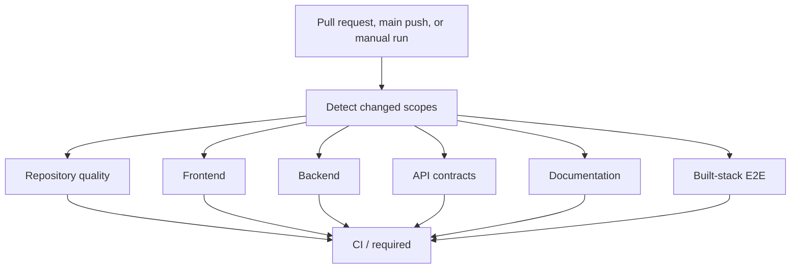

# Continuous integration

IssueScout treats CI as an executable engineering policy. Pull requests do not receive repository or deployment write permissions, actions are pinned to immutable commit SHAs, superseded runs are cancelled, and every job has a bounded timeout.

## Pipeline



Change detection avoids unrelated expensive work, but `CI / required` always runs. It accepts an individual job only when that job succeeds or was legitimately skipped. A failure or cancellation fails the aggregate status, so branch protection needs one stable required check instead of a changing list of path-aware checks.

## Enforced gates

| Job                | Enforcement                                                                                                                      |
| ------------------ | -------------------------------------------------------------------------------------------------------------------------------- |
| Repository quality | Prettier, gofmt, architecture dependencies, actionlint, workflow policy, ShellCheck, Markdown, Conventional Commits, PR template |
| Frontend           | Type-aware ESLint, strict TypeScript, Vitest coverage, production build, gzip bundle budget                                      |
| Backend            | golangci-lint, race detector, atomic coverage, production build                                                                  |
| API contracts      | Redocly OpenAPI lint and bidirectional Gin route drift                                                                           |
| Documentation      | markdownlint across repository-owned Markdown                                                                                    |
| End-to-end         | Production Vite preview and compiled Go API in Chromium                                                                          |

The workflow does not use pull request secrets. Failure evidence is retained for seven days; the validated OpenAPI contract is retained for 14 days. E2E evidence includes the HTML report, trace, screenshot, and video when Playwright produces them.

## Local reproduction

Install the locked workspace dependencies first:

```sh
pnpm install --frozen-lockfile
```

The normal gate is:

```sh
pnpm run check
```

Run the stricter CI gates with:

```sh
pnpm run coverage:api
pnpm run coverage:web
pnpm run bundle:check
pnpm run contracts:check
pnpm run lint:docs
pnpm run lint:workflows
pnpm run e2e
```

`golangci-lint`, `actionlint`, and `shellcheck` are expected developer tools. CI installs or provisions fixed versions. The workflow pins third-party actions by commit SHA; Dependabot proposes controlled SHA updates.

## Budgets

`config/quality-budgets.json` is the single budget source:

- API statement coverage: at least 82%;
- web statements, branches, functions, and lines: at least 70%;
- largest JavaScript asset: no more than 140 KiB gzip;
- all JavaScript and CSS assets: no more than 180 KiB gzip.

Raise coverage expectations as features gain tests. Budget reductions require measured justification in the pull request and must not conceal a regression.

## Pull request policy

A ready pull request must contain:

- a GitHub closing keyword such as `Closes #13`;
- `Summary`, `Related issue`, `Validation`, `Performance impact`, `Security impact`, and `Self-review` sections;
- no incomplete checkboxes;
- at least one non-merge Conventional Commit.

Draft pull requests may retain incomplete self-review boxes. The metadata gate reruns when a pull request is edited or marked ready.

## Recommended main protection

Configure the `main` branch with:

1. Require a pull request before merging.
2. Require `CI / required` and require branches to be up to date.
3. Require conversation resolution.
4. Apply protection to administrators.
5. Block force pushes and branch deletion.
6. Require one approval in a multi-maintainer team. A single-maintainer repository may use zero required approvals while retaining the automated gate and explicit self-review.
7. Do not require linear history while merge commits are the documented strategy.

Repository Actions permissions should default to read-only. Allow GitHub Actions to create pull requests only for an explicitly reviewed automation use case. Release and deployment write permissions belong in dedicated workflows with protected environments, not in pull request CI.

## Updating actions

Never replace a full action SHA with a mutable tag. Verify the upstream release and compare the action source before accepting a Dependabot SHA update. Run `pnpm run lint:workflows` locally; the policy checker rejects mutable action references, write-level top permissions, `pull_request_target`, inherited secrets, missing concurrency, and jobs without timeouts.
