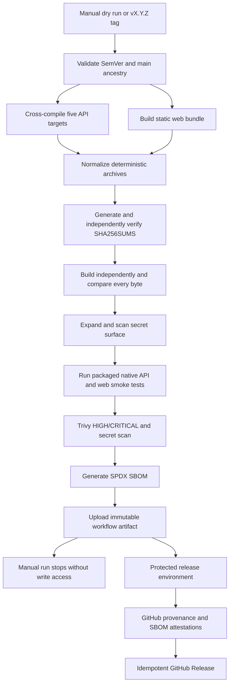

# Secure delivery

IssueScout uses a Docker-free release model. The API is distributed as
cross-compiled Go executables and the frontend as a static web archive. A
hosting provider may consume those files, but provider-specific credentials and
commands do not belong in the repository until a concrete target is selected.

## Release artifacts

Every semantic-version release contains:

| Artifact                                            | Purpose                                       |
| --------------------------------------------------- | --------------------------------------------- |
| `issuescout-api-<version>-darwin-amd64.tar.gz`      | macOS Intel API                               |
| `issuescout-api-<version>-darwin-arm64.tar.gz`      | macOS Apple Silicon API                       |
| `issuescout-api-<version>-linux-amd64.tar.gz`       | Linux x86-64 API                              |
| `issuescout-api-<version>-linux-arm64.tar.gz`       | Linux ARM64 API                               |
| `issuescout-api-<version>-windows-amd64.tar.gz`     | Windows x86-64 API                            |
| `issuescout-web-<version>.tar.gz`                   | Provider-neutral static frontend              |
| `SHA256SUMS`                                        | Exact SHA-256 digest for every archive        |
| `issuescout-release.spdx.json`                      | SPDX software bill of materials               |
| GitHub artifact attestations                        | Build provenance and SBOM binding             |
| An embedded `release-manifest.json` in each archive | Version, commit, creation time, and target OS |

Build timestamps come from the Git commit, tar members are sorted, ownership and
modes are normalized, and gzip timestamps are disabled. Rerunning a release for
the same source produces the same archives.

Reproduce the complete build, byte comparison, extracted-content scan, and
native smoke test locally:

```sh
pnpm run release:reproducibility -- v0.1.0
```

The archive scan rejects `.env` files, source maps, private-key formats,
server-only configuration in web assets, and GitHub, Neon/PostgreSQL, or AWS
credential-shaped content. The packaged API health check proves
`X-Request-ID` correlation and graceful SIGTERM shutdown.

## Release flow



The build job has read-only repository access. Only the `publish` job receives
`contents`, `attestations`, and `id-token` write permissions, and it runs behind
the `release` environment. Pull requests and manual dry runs never execute that
job.

## Creating a release

1. Ensure `main` has successful `CI required` and `Security required`
   checks.
2. Run the `Release` workflow manually with `dry_run=true`.
3. Review all archive, smoke, scan, SBOM, and workflow evidence.
4. Create an annotated tag such as `v1.2.0` from a commit reachable from
   `main`, then push it.
5. Approve the protected `release` environment when the evidence is expected.
6. Verify an archive before use:

   ```sh
   gh release download v1.2.0 --repo tensho1026/github-issue-search
   shasum -a 256 -c SHA256SUMS
   gh attestation verify issuescout-api-v1.2.0-linux-amd64.tar.gz \
     --repo tensho1026/github-issue-search
   ```

Prerelease tags such as `v1.2.0-rc.1` create GitHub prereleases. A rerun uploads
the same evidence with `--clobber`, making the operation idempotent.

## Promotion contract

The `Deploy` workflow is a provider-neutral promotion gate. It does not pretend
that a cloud target exists. A non-dry run:

1. validates a `staging` or `production` environment, release tag, and public
   HTTPS health endpoint;
2. enters the selected protected GitHub environment;
3. downloads the published release;
4. rechecks archive manifests and checksums;
5. verifies GitHub attestations for every archive;
6. rescans the downloaded evidence;
7. records a promotion manifest;
8. checks the configured environment endpoint after the external provider
   handoff.

A future provider adapter must deploy only one of the verified archives. It
must be a dedicated job or reusable workflow, use GitHub OIDC instead of a
long-lived key, preserve the checksum in its deployment record, and run before
the existing health check. It must not accept an arbitrary shell command as an
input.

## Rollback

Record the previously healthy release tag before provider promotion. If the
health check fails:

1. stop the rollout;
2. redeploy the previous tag using its attested archive and checksum;
3. rerun the same health endpoint;
4. preserve the failed workflow and promotion artifacts for 90 days;
5. open an incident issue containing the run URL, environment, failed release,
   previous release, symptoms, and rollback result.

Never rebuild an old version to roll back. A rebuild is a different artifact;
use the archived, attested release.
