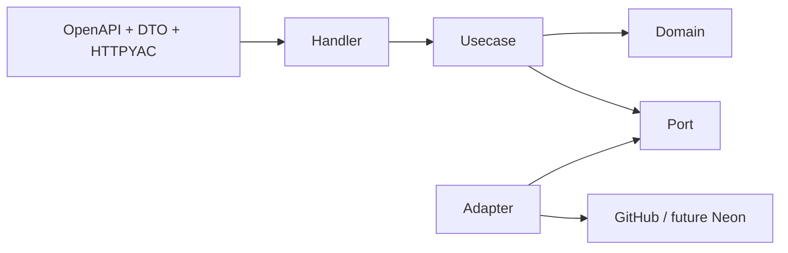

# Extension playbooks

These playbooks preserve the anonymous core, dependency direction, and bounded
behavior when IssueScout grows.

## Add an API feature

1. Define or extend domain value objects and pure rules.
2. Add a use-case interface that depends only on domain and ports.
3. Extend a port only when the application needs a new capability.
4. Implement the external adapter and normalize transport data there.
5. Add handler DTO validation and response mapping.
6. Update OpenAPI before generating frontend types.
7. Register the route in the composition root.
8. Add domain, adapter, use-case, handler, router, contract, and E2E tests as
   appropriate.
9. Run `pnpm run architecture:check`, `pnpm run contracts:check`, and the strict
   gate.

## Add a GitHub field or query

- Prove the field is needed by a use case; do not expose raw transport shape.
- Add an explicit collection, page, body, and concurrency bound.
- Preserve context cancellation and the retry matrix: only transport failures
  and 502/503/504 are retried, with at most three total attempts.
- Validate upstream counts, nullability, and partial results.
- Add adapter tests for success, partial data, rate limit, timeout, malformed
  data, and response size.
- Extend the deterministic mock if the behavior belongs to E2E.

## Add or change an analysis rule

Follow [Rule-based issue analysis](issue-analysis.md). Keep the engine pure,
use a stable rule ID, bound text once, and add positive, negative, boundary,
and interaction tests. Recalculate no score in handlers or React.

## Add a cache

Read [ADR 0003](adr/0003-bounded-in-memory-caches.md). Define a port at the
application boundary, a canonical key that contains no secret, fixed capacity
and TTL, deep-copy semantics, cancellation-aware singleflight, and deterministic
clock tests. Document the TTL and safe override.

## Add authenticated persistence

1. Keep anonymous routes free of session and database dependencies.
2. Complete GitHub OAuth on the API using state, PKCE where supported, secure
   HTTP-only cookies, CSRF defense, rotation, and bounded expiry.
3. Put account identity and saved-data operations behind application ports.
4. Extend the Neon-compatible PostgreSQL adapter with least-privilege
   migrations.
5. Fail authenticated writes closed when the database is unavailable; anonymous
   analysis must remain healthy.
6. Never send a database credential, OAuth client secret, or server token to
   the browser.
7. Test and monitor the invariant that anonymous requests perform zero DB
   reads and writes.

## Add a frontend feature

Use React Router for shareable location state, TanStack Query for server state,
React Hook Form for forms, and established Radix-based primitives for accessible
interaction. Put the feature under `src/features/<name>`, call only the shared
API client, distinguish loading/empty/error/partial/success states, and test
keyboard, mobile, unsafe text, and retry behavior.

## Add a deployment provider

Read [Delivery](delivery.md) and
[ADR 0005](adr/0005-docker-free-delivery.md). Consume only a verified archive
and checksum. Use a dedicated workflow job, protected environment, and OIDC;
do not accept arbitrary shell input or introduce an OCI/container dependency.
Preserve provider-neutral promotion metadata and health verification.

## Change documentation or configuration

Update the executable source, example environment, configuration reference,
commands, and troubleshooting in the same PR. `pnpm run docs:check` rejects
missing variables, commands, paths, error codes, invalid Mermaid, and broken
local links. `pnpm run http:check` rejects uncovered OpenAPI operations,
unsafe environments, invalid HTTPYAC, and missing negative boundaries.
