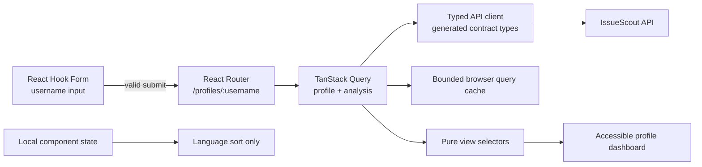

# Frontend architecture

IssueScout's web application is a strict TypeScript React application. It keeps
the anonymous profile journey shareable, cancellation-aware, accessible, and
independent of future authenticated database features.

## Route and state ownership



The ownership rules are deliberate:

- React Hook Form owns input value, validation messages, and submission state.
- React Router owns the selected username because the result must be linkable.
- TanStack Query owns remote data, cache lifetime, retry policy, and request
  cancellation.
- Component state owns only transient presentation such as language ordering.
- The Go API owns analysis and recommendation rules. React components format
  evidence but do not recreate domain scoring.

No global client-state store is needed for the anonymous flow.

## API boundary

`packages/contracts/openapi.yaml` is the contract source. The
`contracts:generate` command produces TypeScript models in
`apps/web/src/shared/api/generated`; `contracts:check` fails when committed
output drifts from OpenAPI.

Components never call `fetch` directly. Profile hooks call the shared client,
which:

- accepts TanStack Query's `AbortSignal`;
- validates JSON content types and the shared success/error envelope;
- converts failures to a typed `ApiError`;
- uses the configured, credential-free `VITE_API_BASE_URL`;
- retries at most one transient failure and never retries validation,
  forbidden, not-found, or rate-limit responses.

The profile and analysis requests run concurrently. Navigating away aborts both
requests, so obsolete work cannot continue updating the route.

## Component system

Repository-owned components in `apps/web/src/components/ui` follow shadcn
composition conventions and wrap Radix primitives where interaction behavior
matters. Class Variance Authority defines button and badge variants,
`tailwind-merge` resolves utility overrides, and Lucide supplies icons that are
decorative by default unless an accessible label is explicitly required.

The shared primitives include:

- buttons, inputs, labels, fields, cards, badges, alerts, and skeletons;
- keyboard-accessible Dialog, Popover, Select, and Tooltip components;
- a semantic icon adapter and `cn` class utility;
- a responsive application shell with skip navigation, visible focus rings,
  mobile navigation, and light/dark themes.

Colors, radii, surfaces, focus rings, score tones, and status tones come from
semantic CSS tokens in `apps/web/src/styles.css`. Feature components use those
tokens instead of embedding one-off color values.

## Profile journey states

| State                 | User experience                                                          |
| --------------------- | ------------------------------------------------------------------------ |
| Initial               | Username form; no network request                                        |
| Invalid input         | Inline accessible error; route and API remain unchanged                  |
| Loading               | Named status region and layout-preserving skeletons                      |
| Success               | Identity, metrics, technologies, languages, frameworks, and repositories |
| Empty evidence        | Explicit neutral messages for missing languages/frameworks/repositories  |
| Not found             | Profile-specific recovery with a link back to the form                   |
| Rate limited          | GitHub-specific explanation without an automatic retry storm             |
| Retryable upstream    | Manual retry with pending feedback and request reference when available  |
| Invalid/catch-all URL | Safe error or not-found page; no malformed API request                   |

Partial analysis warnings remain visible alongside successful evidence rather
than replacing the entire result with an error.

## Accessibility verification

Semantic headings, lists, links, progress bars, form descriptions, and status
regions are covered by Testing Library queries that reflect assistive
technology output. Dedicated interaction tests verify:

- dialog focus containment, Escape dismissal, and trigger focus restoration;
- keyboard opening and dismissal of popovers;
- arrow-key selection in Radix Select;
- tooltip content exposed on focus;
- skip navigation and mobile navigation in production Chromium.

Reduced-motion preferences disable nonessential animation.

## Performance budget

Route components are loaded with `React.lazy`. The profile dashboard and form
dependencies are split from the application shell so visitors do not download
every feature before choosing a profile.

Measured gzip sizes on 2026-07-30:

| Checkpoint                                      | Total JS + CSS | Largest JS |
| ----------------------------------------------- | -------------: | ---------: |
| UI system before landing/profile feature routes |     123.83 KiB | within cap |
| Landing and complete profile journey            |     164.70 KiB | 120.45 KiB |
| Enforced maximum                                |     180.00 KiB | 140.00 KiB |

Run `pnpm run build:web && pnpm run bundle:check` after frontend dependency or
route changes. The CI budget reads `config/quality-budgets.json`; changing the
budget is a reviewed engineering decision, not a workaround for a regression.

## Local verification

```sh
pnpm --filter @issuescout/web lint
pnpm --filter @issuescout/web typecheck
pnpm --filter @issuescout/web test:coverage
pnpm run build:web
pnpm run bundle:check
pnpm run e2e
```

The E2E journey uses the production Vite build and compiled Go API. Profile
responses are intercepted with contract-shaped fixtures so browser behavior is
deterministic and does not consume GitHub rate limits.
