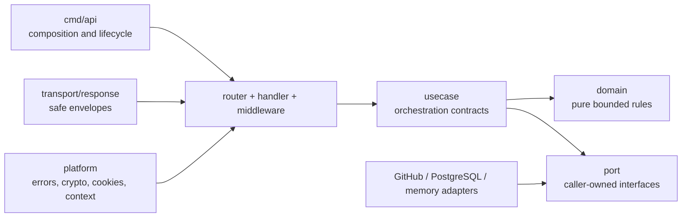

# GoDoc and internal API contracts

IssueScout documents its Go implementation as an internal engineering API.
The module remains under `internal/`, so these comments support contributors
and architectural review without promising third-party compatibility.

## Browse locally

Print complete documentation for all 26 packages from the repository root:

```sh
pnpm run docs:go
```

Inspect one package:

```sh
pnpm run docs:go -- ./internal/usecase
pnpm run docs:go -- ./internal/client/github
```

The script uses the Go toolchain only. It performs no network or database I/O,
does not read `.env`, and does not print secret configuration values. The
equivalent direct command is:

```sh
go -C apps/api doc -all ./internal/usecase
```

Run the documentation policy without the rest of the quality suite:

```sh
pnpm run docs:go:check
go -C apps/api test ./...
```

## Dependency and documentation map



| Package group            | Contract documented in GoDoc                                      |
| ------------------------ | ----------------------------------------------------------------- |
| `cmd/api`, `cmd/migrate` | composition, startup, migration, and shutdown lifecycle           |
| `bootstrap`, `router`    | dependency selection, optional auth, and route composition        |
| `handler`, `middleware`  | input bounds, context propagation, headers, logging, and recovery |
| `usecase`, `port`        | caller/implementer duties, fan-out, ownership, and error mapping  |
| `domain/*`               | validation, zero values, evidence, scoring, and invariants        |
| `client/*`, `database/*` | timeouts, retries, cancellation, hashing, and persistence safety  |
| `cache/memory`           | synchronization, TTL/LRU behavior, and defensive copies           |
| `platform/*`, `response` | secrets, cookies, correlation, safe errors, and JSON envelopes    |

The architecture dependency rules remain authoritative in
[System architecture](architecture.md). GoDoc explains the contract at the
declaration that implements that design.

## Required comment contract

Every production package must have one comment beginning with `Package` or,
for an executable, `Command`. Every exported type, function, method, constant,
variable, sentinel error, and named interface method must have canonical
GoDoc. A declaration comment starts with its identifier; a documented
constant group may explain a closed vocabulary as one unit.

Comments explain behavior that a caller cannot safely infer from a name:

- whether the zero value is meaningful;
- validation limits and defaulting;
- slice, map, byte, URL, and secret ownership;
- context cancellation and deadline propagation;
- bounded pagination, retries, concurrency, singleflight, and cache behavior;
- concurrency safety and synchronization;
- partial-result, rate-limit, and unknown-evidence semantics;
- error classifications and when `errors.Is` or `errors.As` is supported;
- security boundaries, especially logging, cookies, CSRF, tokens, and account
  ownership;
- constructor requirements and lifecycle responsibilities.

Do not restate an identifier, copy an implementation line by line, promise
behavior the code does not enforce, or expose a credential in an example.

## Executable examples

Examples live beside the package they explain and run through `go test`:

| Example                       | Contract demonstrated                                      |
| ----------------------------- | ---------------------------------------------------------- |
| `config.ExampleLoad`          | credential-free defaults and optional auth/database        |
| `memory.ExampleIssueSearch`   | bounded cache construction and defensive ownership copies  |
| `github.ExampleNewClient`     | client construction and immediate cancellation propagation |
| `response.ExampleResponder_*` | success metadata and safe wrapped-error serialization      |
| `router.ExampleNew`           | complete anonymous composition with the offline adapter    |

Examples must be deterministic, offline, free of real user data and secrets,
and include an `Output` assertion when a stable observable result exists.

## Enforcement

`scripts/ci/check-godoc.go` uses only the Go standard library to parse every
non-test, non-generated Go file under `apps/api`. It checks:

1. canonical package or command documentation;
2. all exported production declarations, including standard interface methods
   such as `Error`, `String`, and `Unwrap`;
3. each named exported method inside an interface;
4. comments that begin with the documented identifier.

The Backend Actions job runs this policy before golangci-lint, race/Example
tests, coverage, fuzzing, performance budgets, and the production build.
`pnpm run quality:strict` exercises the same local policy through the root
lint command.

## Maintenance checklist

When changing Go code:

1. update the comment in the same patch as the behavior;
2. describe context, ownership, concurrency, bounds, errors, and security when
   relevant;
3. add or update an offline Example when construction or composition would be
   clearer as runnable code;
4. run `pnpm run docs:go:check`, `pnpm run test:api`, and
   `pnpm run lint:api`;
5. inspect the rendered package with `pnpm run docs:go -- <package>`;
6. update architecture, HTTP, or operations guides when the contract crosses a
   package boundary.

The AST check catches omissions and canonical naming. Human review remains
responsible for verifying that comments match actual semantics.
