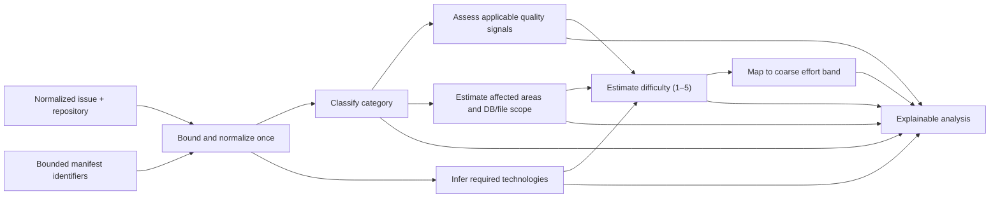

# Rule-based issue analysis

IssueScout analyzes an eligible issue with deterministic domain rules before
the recommendation scorer ranks it. The engine is intentionally pure: it
performs no network, filesystem, cache, database, clock, or random operation.
Identical normalized input therefore produces byte-stable JSON output.

The implementation lives under
`apps/api/internal/domain/issue/analysis_*.go`. Transport and use-case packages
may orchestrate the engine, but they must not duplicate or override its rules.

## Input and safety limits

`AnalyzeIssue` accepts the normalized issue/repository candidate from discovery
plus optional manifest dependency identifiers and a maintainer-guidance flag.
The recommendation use case supplies those identifiers from size-bounded root
`package.json` and `go.mod` blobs; the pure engine does not read manifests
itself.
It inspects at most:

| Input                           | Limit  | Behavior beyond the limit                     |
| ------------------------------- | ------ | --------------------------------------------- |
| Issue body                      | 64 KiB | UTF-8-safe truncation; confidence becomes low |
| Issue title                     | 16 KiB | UTF-8-safe truncation                         |
| Labels                          | 100    | Remaining labels are ignored                  |
| Manifest dependency identifiers | 100    | Remaining dependencies are ignored            |

The engine lowercases and trims text once, deduplicates and sorts collection
inputs, and uses boundary-aware term matching. Evidence contains stable rule
identifiers and fixed descriptions—not arbitrary issue text, dependency
content, tokens, or excerpts.

## Evidence and confidence

Every inferred result uses one of three confidence values:

- `high`: explicit labels/dependencies or a sufficiently detailed,
  non-truncated description support the result;
- `medium`: useful but indirect title/body/repository evidence exists;
- `low`: evidence is sparse, defaulted, or truncated.

Evidence sources are typed as title, body, label, repository language,
dependency, issue metadata, or derived. Rule IDs are stable diagnostic
identifiers. They explain why a result occurred without turning heuristic
output into a promise about the eventual implementation.

## Issue quality

The quality assessment reports the following signals in a fixed order:

1. problem description;
2. expected behavior;
3. current behavior;
4. reproduction steps;
5. implementation guidance;
6. related files;
7. screenshot or visual evidence;
8. test or verification method;
9. acceptance criteria.

Each signal is `present`, `absent`, `not_applicable`, or `unknown`.

- Bug-only signals—expected/current behavior and reproduction—are
  `not_applicable` for a non-bug issue.
- Screenshot evidence is applicable to bug, UI, and accessibility issues.
- A body shorter than 20 normalized characters is insufficient to prove
  absence, so every quality signal is `unknown`.
- The zero-to-100 score is the percentage of applicable signals that are
  present. Not-applicable and unknown signals are never counted as failures.

The score measures specification detail, not the quality of the maintainer or
the value of the proposed work.

## Category classification

The supported primary categories are:

| Category      | Representative evidence                               |
| ------------- | ----------------------------------------------------- |
| Bug           | `bug`/`defect` labels, failures, regressions, crashes |
| Feature       | feature/enhancement labels, new-capability language   |
| Documentation | docs/README/GoDoc/OpenAPI wording                     |
| Testing       | test coverage, regression, unit/integration/E2E tests |
| Refactoring   | technical debt, restructure, cleanup                  |
| Performance   | latency, allocations, benchmarks, optimization        |
| Accessibility | WCAG, ARIA, keyboard, screen-reader work              |
| UI            | component, layout, CSS, responsive behavior           |
| Backend       | API, handler, server, database, GraphQL/gRPC          |
| DevOps        | CI, deployment, release, infrastructure               |
| Localization  | translation, locale, i18n/l10n                        |

An explicit label scores 100, a title keyword 40, and a body keyword 20.
Matches are ordered by total score and then fixed rule priority. The highest
match is primary while all matches remain available for scope analysis. When
there is no category evidence, `feature` is a low-confidence neutral fallback.

## Required technologies

Technology rules combine three evidence levels:

- a manifest dependency is high confidence;
- an explicit title/body term is medium confidence;
- the repository primary language is medium confidence.

Duplicate technologies merge their evidence and retain the strongest
confidence. Results are sorted by confidence, kind, and canonical name. The
initial table covers common languages, React/Vue/Angular/Svelte/Next.js/Gin,
REST/GraphQL/gRPC, SQL/PostgreSQL/MySQL/MongoDB/Redis, testing, and major
delivery platforms. Dependency matching uses package/module boundaries; a
substring such as `spring` cannot accidentally activate the npm `pg` rule.

## Change scope

Affected areas are returned in the stable order Frontend, Backend, Tests,
Migration, Documentation, and Infrastructure. Database impact is separately
reported as present, absent, or unknown. Explicit phrases such as
`DB change: none` override generic database terminology and prevent a false
migration result.

File impact is deliberately a range rather than a fabricated exact count:

| Band      | Typical evidence                                      |
| --------- | ----------------------------------------------------- |
| 1 file    | narrowly scoped docs/localization                     |
| 1–3 files | one small bug, test, UI, or accessibility change      |
| 2–5 files | ordinary feature/backend work                         |
| 4–8 files | broad refactor/performance/DevOps or multi-area work  |
| 9+ files  | architecture, breaking, multi-service, or broad scope |

Related file paths in the issue increase confidence but do not make the range
an implementation guarantee.

## Difficulty

Difficulty is clamped to the documented five-level scale:

| Level | Label     | Baseline examples                                   |
| ----- | --------- | --------------------------------------------------- |
| 1     | Very Easy | typo, README, small localization                    |
| 2     | Easy      | focused bug/test/UI/accessibility change            |
| 3     | Medium    | feature, backend, DevOps, performance, refactoring  |
| 4     | Hard      | schema/migration, authentication, broad refactor    |
| 5     | Very Hard | security, breaking architecture, cross-service work |

Category establishes the baseline. Starter labels reduce it by one.
Recognized explicit difficulty labels then establish a minimum. Database or
migration work, cross-layer scope, four or more areas, five or more
technologies, and large discussions can increase the estimate. Security,
breaking, architectural, large-migration, and cross-service evidence raises it
to level five.

Maintainer guidance increases confidence, not the difficulty value. This keeps
the estimate about the work rather than about how communicative a maintainer
is.

## Effort

Effort is an estimated display band, not a schedule or commitment:

| Band       | Typical mapping                                                  |
| ---------- | ---------------------------------------------------------------- |
| 30 minutes | level-one documentation/localization                             |
| 2 hours    | level-one general or level-two docs/testing/bug                  |
| Half day   | other level-two work or level-three docs/testing                 |
| 1 day      | ordinary level-three work or focused level-four work             |
| 3 days     | level five, migration/database, or broad level-four feature work |

The UI and API must preserve the `estimated` wording and show confidence and
evidence alongside the band.

## Extending rules safely

1. Add or modify a declarative rule table in the relevant `analysis_*.go`
   file; do not add scoring branches to handlers or React components.
2. Use a stable, namespaced evidence rule ID.
3. Keep matching bounded, deterministic, and free of raw-content evidence.
4. Add table-driven positive, negative, boundary, and interaction tests.
5. Verify all 11 categories, 5 difficulties, and 5 effort bands remain
   reachable.
6. Run race tests, strict lint, coverage, and the complete monorepo gate.

Current rules do not inspect repository source trees or predict exact files.
Those enrichments require separately bounded repository evidence and must keep
this pure engine as the final decision boundary.
