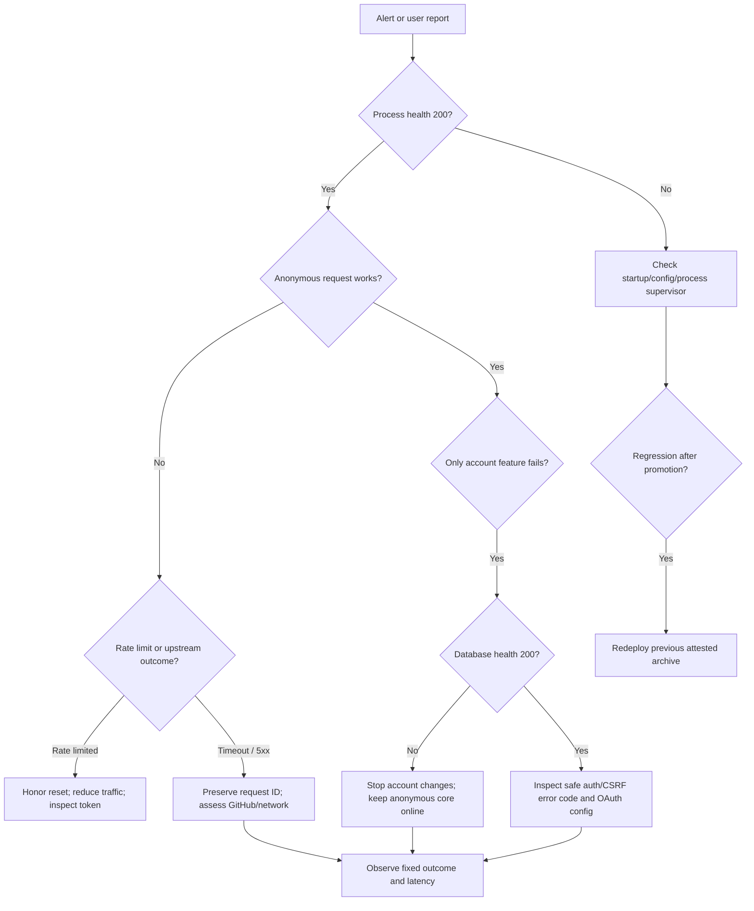

# Operations runbook

This runbook covers native startup, health interpretation, safe diagnostics,
release promotion, incidents, and rollback. It assumes no container runtime.

## Service inventory

| Component                  | Required for anonymous core | State                                   |
| -------------------------- | --------------------------- | --------------------------------------- |
| Static React web assets    | Yes                         | Immutable host artifact                 |
| Go API process             | Yes                         | Native binary, in-memory bounded caches |
| GitHub public API          | Live data only              | External REST/GraphQL dependency        |
| Neon-compatible PostgreSQL | No                          | Authenticated account data only         |
| GitHub OAuth App           | No                          | Optional sign-in only                   |

## Startup and preflight

Local credential-free preflight:

```sh
pnpm install --frozen-lockfile
make dev-smoke
pnpm run http:check
```

Production preflight:

1. select an attested release archive for the target host;
2. verify `SHA256SUMS` and GitHub provenance;
3. configure only documented environment values;
4. keep `AUTH_COOKIE_SECURE=true` and exact HTTPS origins;
5. apply and verify migrations before enabling OAuth/account traffic;
6. start the API with a process supervisor;
7. serve web assets with history fallback to `index.html`;
8. check process health, then optional database readiness;
9. run anonymous profile/search/detail smoke before account smoke.

Do not use `/api/health/database` as anonymous liveness. A database incident
must not restart or remove a healthy public API.

## Health interpretation

| Probe                      | Healthy meaning                                             | Dependency |
| -------------------------- | ----------------------------------------------------------- | ---------- |
| `GET /api/health`          | Process, config, router, middleware, and JSON envelope work | None       |
| `GET /api/health/database` | Optional authenticated store answers a bounded ping         | PostgreSQL |
| Web `/`                    | Static build is served with client-route fallback           | Web host   |
| `GET /openapi.yaml`        | Embedded API contract is available when enabled             | API only   |

Use a safe caller-owned request ID:

```sh
curl --fail-with-body \
  --header 'X-Request-ID: ops-health-001' \
  https://api.replace.example/api/health
```

The response header, JSON metadata, request log, and any GitHub completion log
share that ID.

## Diagnostic flow



## Safe log fields

Filter by fixed route template, status, application error code, cache status,
GitHub operation, or GitHub outcome. A useful incident sample includes
timestamp, environment, release checksum, request ID, route, status, latency,
error code, upstream operation/outcome/status, and attempts.

Never request or attach:

- `.env` contents or a database URL;
- GitHub/OAuth tokens, callback code, state, or Cookie values;
- CSRF headers;
- raw GitHub response bodies;
- usernames, repository names, issue body text, user agent, or IP address.

## Incident playbooks

### GitHub rate limit

1. Confirm the fixed `rate_limited` outcome and `GITHUB_RATE_LIMIT_EXCEEDED`.
2. Preserve the reset metadata returned by the API.
3. Do not retry aggressively or rotate through unapproved tokens.
4. Confirm candidate/detail bounds and cache hit ratio have not regressed.
5. Restore only after the quota window or approved credential capacity returns.

### GitHub timeout or 5xx

1. Correlate request and upstream completion events.
2. Check whether attempts stopped at three and latency matches backoff/timeout.
3. Test process health separately.
4. Preserve partial-result warnings when useful output exists.
5. Escalate external incidents without including upstream response content.

### Database unavailable

1. Keep public traffic online.
2. Pause OAuth/account mutations if the provider does not already fail them.
3. Check database health and provider status without printing the URL.
4. Verify pool saturation, TLS, migrations, and connection/query deadlines.
5. Restore account traffic, then test session, bookmarks, preferences, export.

### Authentication or CSRF failures

1. Determine whether the session endpoint reports configured/authenticated.
2. Restart expired or consumed OAuth flows; never replay a callback URL.
3. Verify fixed callback/frontend origins and secure Cookie mode.
4. Refresh only with the current in-memory CSRF value.
5. Treat unexpected repeated failures as a possible credential incident.

### Latency regression

1. Separate cache hit/miss and fixed route templates.
2. Separate IssueScout latency from the GitHub completion latency.
3. Run `pnpm run performance:api`, the production-load usecase tests,
   `pnpm run e2e`, and `pnpm run bundle:check`.
4. Inspect changed fan-out, response sizes, cache key cardinality, and retries.
5. Do not raise a budget until the regression is understood and reviewed.

## Cache behavior and scaling

All public caches are process-local. Restarting or horizontally adding API
instances creates cold independent caches, which is correct but can increase
GitHub traffic. Capacity is a hard entry count, not a memory target; measure
representative entry size before increasing it.

Scale the native API behind a known ingress only after:

- each instance has the same release checksum and configuration bounds;
- `TRUSTED_PROXY_CIDRS` contains only actual ingress CIDRs;
- health checks use `/api/health`;
- PostgreSQL pool ceilings are multiplied by maximum instance count;
- GitHub token capacity and rate-limit behavior are reviewed;
- external logs retain request IDs but do not add identity labels.

## Release, promotion, and rollback

Follow [Docker-free delivery](delivery.md). The short form is:

1. run a dry release;
2. review reproducibility, scan, SBOM, and smoke evidence;
3. publish an annotated `vX.Y.Z` tag from `main`;
4. approve the protected release environment;
5. promote the exact checksum through the protected target environment;
6. record the previously healthy version;
7. verify public health and anonymous journey;
8. enable/verify account traffic only afterward.

Rollback redeploys the previous attested archive. Never rebuild an old source
revision and call it the same release.

## Handover evidence

An operator taking ownership should retain:

- repository and release tag;
- commit and archive SHA-256;
- CI, Security, Release, and Deploy workflow URLs;
- target environment and health origin;
- migration catalog status;
- safe smoke request IDs;
- known limitations and open incident/exception issues.

Use [Handover walkthrough](handover.md) for the clean-room transfer.
