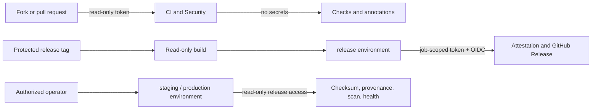

# Security engineering

IssueScout assumes pull request content, GitHub API responses, repository files,
release inputs, and deployment inputs are untrusted. Secrets stay on the Go
server; the browser receives only normalized API responses.

## Automated controls

| Control                    | Scope                                                                  | Failure policy                  |
| -------------------------- | ---------------------------------------------------------------------- | ------------------------------- |
| CodeQL                     | Go and JavaScript/TypeScript with extended security queries            | Any analysis failure blocks     |
| Dependency review          | New pull request dependencies and licenses                             | HIGH or CRITICAL blocks         |
| Trivy repository scan      | Go/pnpm dependencies, secrets, workflows, and configuration            | Fixed HIGH or CRITICAL blocks   |
| Trivy release scan         | Packaged release directory and embedded content                        | Fixed HIGH or CRITICAL blocks   |
| zizmor                     | GitHub Actions attack surface with the pedantic persona                | Medium+ / medium-confidence     |
| actionlint and policy      | Workflow syntax, immutable action SHAs, permissions, timeout, triggers | Any violation blocks            |
| golangci-lint and ESLint   | Security-aware static checks, type safety, resource handling           | Any configured violation blocks |
| Checksums and attestations | Six release archives, SPDX SBOM, build identity                        | Any mismatch blocks publication |

No vulnerability is silently ignored. A temporary exception requires a
dedicated issue containing the advisory, exploitability analysis, owner,
expiration date, compensating control, and removal plan. The default policy
ignores only findings that have no upstream fix.

## Workflow trust boundaries

The repository forbids `pull_request_target`, inherited secrets, mutable action
tags, top-level write permissions, unbounded jobs, and unapproved job-level
write scopes. The allowlist is code-reviewed in
`scripts/ci/check-workflow-policy.mjs`. Forked pull requests cannot reach the
release or promotion workflows because both are manual/tag-only workflows and
protected environments are never entered from pull request events.

## Credentials and data

- Do not commit tokens, `.env` files, user data, API payload dumps, or private
  repository content.
- The workflow-provided `GITHUB_TOKEN` is job-scoped and receives only
  permissions listed in each workflow.
- A future hosting provider must use environment-scoped OIDC federation.
- The runtime GitHub token required for GraphQL issue search is accepted only
  by the backend process and must never be sent to browser code, logs, errors,
  analytics, cache keys, or fixtures.
- Logs use request IDs and bounded metadata; authorization headers and upstream
  response bodies are not logged.

## Incident response

For a suspected credential leak, malicious dependency, compromised action, or
release integrity failure:

1. disable the affected workflow or environment;
2. revoke the credential or trust relationship;
3. preserve the run, checksums, attestations, SBOM, dependency graph, and logs;
4. identify all releases and environments containing the affected digest;
5. roll back using a previously attested release;
6. patch or pin the dependency/action and run the complete CI and Security
   workflows;
7. document timeline, impact, root cause, containment, recovery, and preventive
   actions in an incident issue;
8. rotate credentials again if their exposure window cannot be proven closed.

Do not delete failed evidence during an investigation. Release inputs are kept
for 14 days and promotion evidence for 90 days; GitHub Releases and
attestations remain the long-term record.
