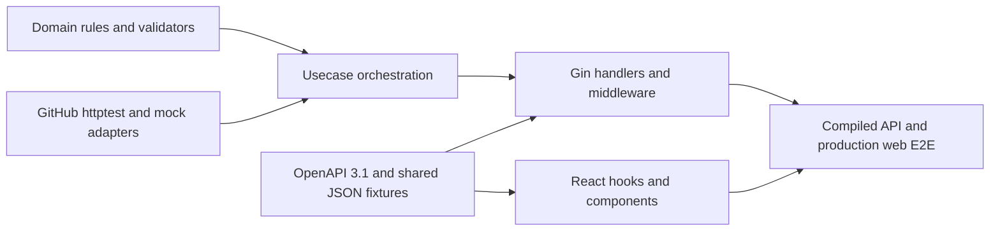

# Test strategy

IssueScout validates behavior at the narrowest useful boundary and retains a
small production-shaped journey across the entire anonymous stack. All
required suites are deterministic, parallel-safe, and independent of live
GitHub availability.

## Boundary map



| Layer          | Tooling                                  | What it proves                                         |
| -------------- | ---------------------------------------- | ------------------------------------------------------ |
| Go domain      | table tests, fuzz tests, benchmarks      | rule invariants, parser safety, bounded cost           |
| Go adapter     | `httptest.Server`, race detector         | retries, cancellation, decoding, pagination, limits    |
| Go application | fakes and in-memory caches               | fan-out, singleflight, fallback, error mapping         |
| HTTP           | Gin recorder and typed fixtures          | status, envelope, headers, validation, middleware      |
| Contract       | Redocly, Ajv, generated types            | OpenAPI semantics, fixture shape, route and type drift |
| React          | Vitest and Testing Library               | forms, hooks, routing, a11y states, safe presentation  |
| Built stack    | Playwright and deterministic API adapter | profile → search → detail and resilient errors         |
| Native process | Node test runner and real child groups   | startup interruption, readiness, signal cleanup        |
| Release        | independent builds and packaged smoke    | byte identity, secret surface, request ID, shutdown    |

Tests assert observable behavior. Internal helper calls are asserted only when
the call count is itself a bounded-resource or retry invariant.

## Commands

Install the locked dependencies once:

```sh
pnpm install --frozen-lockfile
```

Run the normal suites:

```sh
pnpm run test:api
pnpm run test:web
pnpm run test:dev
pnpm run e2e
```

Run the strict quality evidence:

```sh
pnpm run coverage:api
pnpm run fuzz:api
pnpm run performance:api
pnpm run coverage:web
pnpm run bundle:check
pnpm run contracts:check
```

`pnpm run quality:strict` combines the complete repository gate. To investigate
intermittency before opening a pull request, run the affected suite twice:

```sh
pnpm run test
pnpm run test
pnpm run e2e
pnpm run e2e
```

No test command requires `GITHUB_TOKEN`.

## Deterministic GitHub adapter

The built-stack suite starts the compiled API with:

```text
APP_ENV=test
USE_GITHUB_API_MOCK=true
```

Configuration rejects mock mode in development, staging, and production. The
adapter never opens a network connection and never falls back to the live
GitHub client.

| Input              | Result                                                           |
| ------------------ | ---------------------------------------------------------------- |
| `octocat`          | complete profile, repository, search candidate, and issue detail |
| `no-results`       | valid profile and an explicit empty issue result                 |
| `missing-user`     | GitHub user not found                                            |
| `rate-limited`     | GitHub rate-limit error                                          |
| any other username | not found, with no live fallback                                 |

Add a scenario only when it represents reusable application behavior. Return
fresh domain values, honor `context.Context`, and cover the scenario in the
adapter unit test and the narrowest browser or handler test.

## Live GitHub client tests

The production adapter uses `httptest.Server` or an injected round tripper.
Coverage includes:

- malformed and oversized payloads;
- cancellation and upstream timeout;
- 404, 403, and rate-limit mapping;
- exactly one attempt for non-retryable responses;
- at most three attempts for 502, 503, 504, and transport failures;
- response-body closure, bounded pagination, and bounded GraphQL windows.

Run these tests with the race detector through `pnpm run coverage:api`.
Cancellation tests must finish from context signals rather than arbitrary
sleep-based synchronization.

## Fuzz and performance gates

CI executes exactly 50,000 fuzz cases per target for GitHub usernames, search
filter values, and issue references. The fixed execution budget avoids
runner-speed-dependent timeouts while preserving a reproducible minimum test
depth. A discovered corpus file is a regression asset: inspect it, retain it
under the owning package when useful, and add a named unit test when the
behavior deserves explanation.

The two bounded domain benchmarks run three fixed 100-operation samples.
`config/quality-budgets.json` sets fail-closed time, byte, and allocation
ceilings. Budgets include broad runner headroom; a budget increase requires a
measured explanation in the pull request. Web gzip limits are enforced from
the same file.

| Budget                                          |      Maximum |
| ----------------------------------------------- | -----------: |
| `BenchmarkAnalyzeIssueBoundedRichInput` latency |      5 ms/op |
| Analysis bytes                                  |   256 KiB/op |
| Analysis allocations                            |       200/op |
| `BenchmarkRecommendBounded` latency             |      1 ms/op |
| Recommendation bytes                            |   128 KiB/op |
| Recommendation allocations                      |     1,000/op |
| Largest JavaScript asset                        | 140 KiB gzip |
| All JavaScript and CSS                          | 180 KiB gzip |

## Contract fixtures

`packages/contracts/fixtures/manifest.json` maps each JSON document to one
OpenAPI component schema. `pnpm run contracts:fixtures` validates types,
required fields, formats, enums, and bounds. It also mutates every valid
fixture to prove unknown envelope/payload fields and missing metadata fail.
Backend tests decode those documents through concrete response types.
Playwright uses the profile fixtures for its focused network-boundary test.

When an HTTP response changes:

1. update `packages/contracts/openapi.yaml`;
2. update or add the representative JSON fixture;
3. update the handler and focused tests;
4. run `pnpm run contracts:check`;
5. never edit generated TypeScript manually.

## E2E failure diagnosis

Playwright runs against the production Vite build and compiled Go binary.
Retries are enabled only in CI. On failure, inspect:

- `playwright-report/` for the HTML timeline;
- `test-results/` for retained trace, screenshot, and video;
- API structured logs for the request ID shown in the UI or response;
- the failing response in the trace network panel.

Open a trace locally with:

```sh
pnpm exec playwright show-trace test-results/<test>/trace.zip
```

Do not point the E2E build at a developer API or enable `reuseExistingServer`
while diagnosing CI-only behavior. Stop those processes first so Playwright
owns both ports.

## Native lifecycle and release tests

`pnpm run test:dev` starts real native child process groups and verifies
cleanup when startup is interrupted and after readiness. Its integration case
sends SIGTERM to the actual supervisor, then proves both API and web ports are
closed.

`pnpm run dev:smoke` proves the local Go/Vite stack without a token.
`pnpm run release:reproducibility -- v0.0.0-test` performs two independent
builds, contract and checksum verification, extracted-content secret scanning,
byte comparison, packaged readiness, request-correlation, and graceful
shutdown checks.
